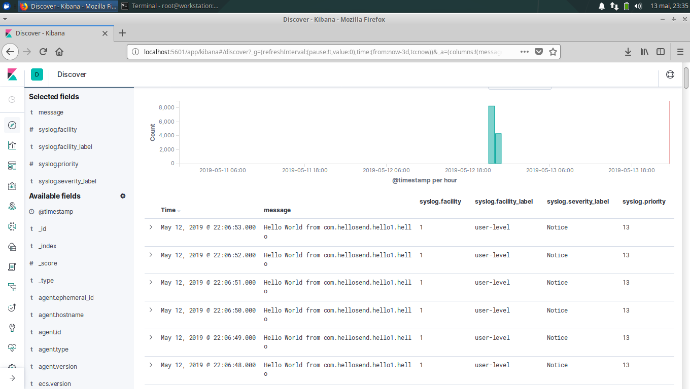

Logs Centralizing
=================

Managing multinodal architectures can sometimes be painful, specially regarding logs management.
Of course you don't want to connect to every host individually to see what happens..That's the 
main reason that motivated the support of syslog inside the n3rv logging component.

How to centralize your nodes logs with FileBeat + ElasticSearch + Kibana
------------------------------------------------------------------------

Through this tutorial we will see how to setup a centralized log management system with ES, 
FileBeat & Kibana, and how to program n3rv to use it.

1. ElasticSearch + FileBeat + Kibana Install
--------------------------------------------

We will assume that the guest OS for your centralized logging system is an Ubuntu Linux 
(it should be easilly transposable to other Distros/ OSes though)

.. code-block:: console
 
   wget -qO - https://artifacts.elastic.co/GPG-KEY-elasticsearch | sudo apt-key add -
   echo "deb https://artifacts.elastic.co/packages/7.x/apt stable main" | sudo tee -a /etc/apt/sources.list.d/elastic-7.x.list

   sudo apt-get install apt-transport-https elasticsearch filebeat kibana

1.1 Launch ElasticSearch
************************

.. code-block:: console

  /etc/init.d/elasticsearch start 

1.2 Configure & Launch Kibana
*****************************

In `/etc/kibana/kibana.yml`, set the follwing parameters:

.. code-block:: console

    server.port "5601"
    server.host "localhost"
    elasticsearch.hosts: ["http://localhost:9200"]

Finally you can start Kibana:

.. code-block:: console

   /etc/init.d/kibana start

The Kibana user interface should now be accessible on `http://localhost:5601`

1.3 Configure Filebeat Input
****************************

Now You will have to add a syslog input in the filebeat.inputs section of `/etc/filebeat/filebeat.yml`:

.. code-block:: console

   filebeat.inputs:

    - type: syslog
       enabled: true
       protocol.udp:
           host: ":514"

You are now ready to restart filebeat:

.. code-block:: console

  /etc/init.d/filebeat restart

2. rsyslog configuration on your nodes'hosts
---------------------------------------------

Now that our centralized logs repository is setup, we will need to configure our hosts to send
its syslog entries on it. To do it, Add the required entries in /etc/rsyslog.conf:

.. code-block:: console

  user.*  			@FileBeat_Host:514

Note: Replace `FileBeat_Host` by the IP/Hostname of your filebeat server.

3. Make your n3rv nodes use syslog
----------------------------------

At this step, all the remains is to add the correct syslog destinations in your 
n3rv logger objects:

.. code-block:: c++

   #include <n3rv/n3rvcommon.hpp>
   #include <n3rv/n3rvservice.hpp>
   #include <n3rv/n3rvservicecontroller.hpp>

   int main() {

       n3rv::logger* ll = new n3rv::logger(n3rv::LOGLV_DEBUG);
       /* We tell the logger to use syslog as dest. */
       ll->add_dest("syslog:svc:user");

       n3rv::start_controller("0.0.0.0",10001,ll);
       n3rv::service svc1("127.0.0.1",10001,ll);

       svc1.run_async();
   }

4. Err.. Profit ?
-----------------

At the end, you should see the logs of all your nodes available on the Kibana interface:

