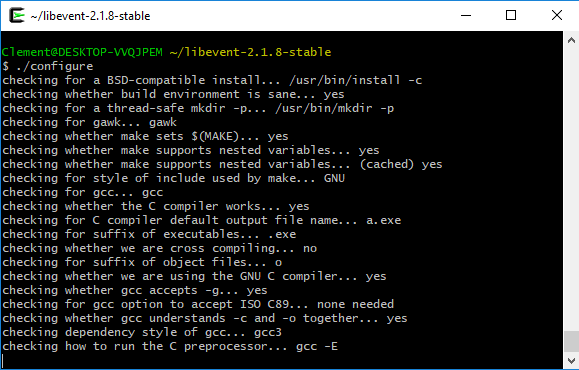
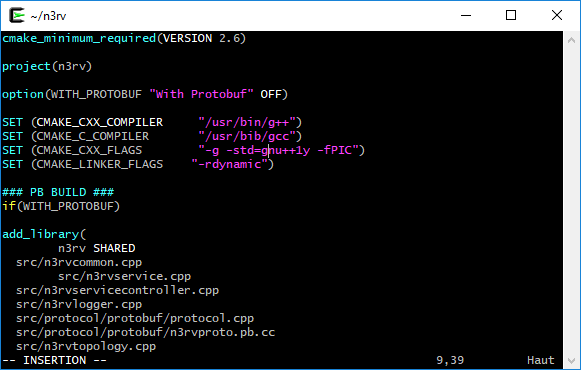
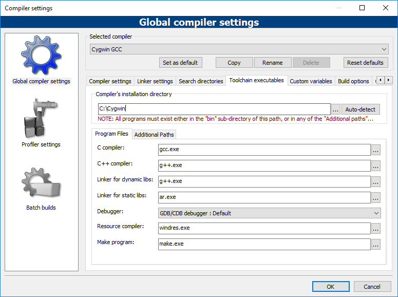
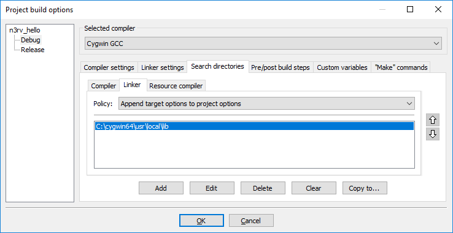
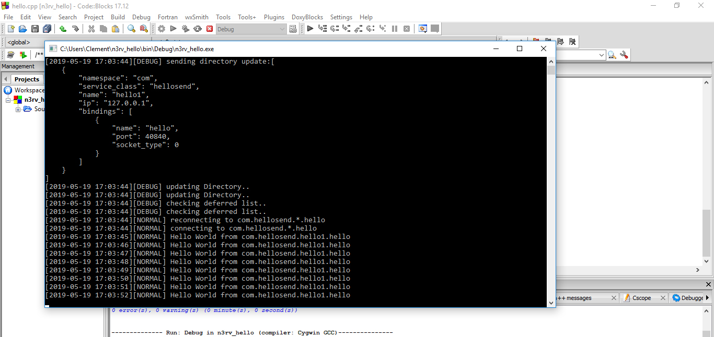
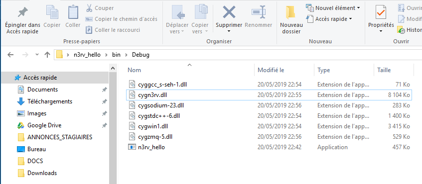

Windows Dev
===========

n3rv services development for Windows
-------------------------------------

The following tutorial will show you how to get started with n3rv on windows environments. As you will see, the
process is not a walk in the park. Sorry for that, we will try to do better for the next releases.

1. Cygwin Install
-----------------

The first step of our windows journey will be to install cygwin on the windows box you plan to develop n3rv services on.
Go to http://www.cygwin.com/install.html and download the file `setup_x86_64.exe`. Once it is downloaded,
launch it. Go through the install steps until you get to the packages selection:

.. image:: _static/img/cyg_g++.png
    :scale: 100%

Here are the packages that you will have to select:

 - gcc-core
 - gcc-g++
 - cmake
 - make
 - libzmq5 v4.2.3
 - libzmq-devel v4.2.3
 - git
 - vim
 - wget

Note: to avoid toolchain config errors, please make sure that the gcc-core package and gcc-g++ are installed with the same version number.

2. The easy way: n3rv binaries install
--------------------------------------

Using the n3rv prebuilt package will save you the entire step 3 (the most painful), which is quite convenient. However if 
you encounter problems building your own projects afterwards, i'm afraid that you'll still have to go through it.

Now it is time to open a cygwin Terminal (Cygwin64 Terminal) to type a few things:

.. code-block:: console

   wget -qOn3rv-cygwin-win64.tgz https://n3rvcpp.github.io/pkg/n3rv-cygwin-win64.tgz
   tar -xvzf n3rv-cygwin-win64.tgz -C/

And this is it, your cygwin is now ready for n3rv services development. Let's go to step 4 !

3. The hard way: full build
---------------------------

If you deliberately chose to build the windows version of the n3rv library, then let's go. As with the simple method we will
need to open a new Cygwin terminal (Cygwin64 Terminal):

3.1 cppzmq
**********

First we need to download the zmq.hpp header for our version of libzmq:

.. code-block:: console
  
  wget -qO/usr/include/zmq.hpp https://raw.githubusercontent.com/zeromq/cppzmq/v4.2.3/zmq.hpp

3.2 libevent
************

The version of libevent provided with cygwin is too old, this is why we will have to build it ourselves. It's no
big deal.

First we fetch the library source code:

.. code-block:: console
  
  wget -qO./libevent.tgz https://github.com/libevent/libevent/releases/download/release-2.1.8-stable/libevent-2.1.8-stable.tar.gz
  tar -xvzf libevent.tgz

Then we launch the build process:

.. code-block:: console
  
  pushd .
  cd libevent-2.1.8-stable
  ./configure --prefix=/usr && make && make install
  popd

Note: Depending on your machine's power, it can take some time.

3.3 Getting n3rv source Code
***************************

Now it is time to get the n3rv library source code from github:

.. code-block:: console
  
  cd ~
  git clone https://github.com/n3rvcpp/n3rv

3.4 CMakeFile.txt Modifications
*******************************

In order to build correctly on cygwin, the n3rv cmake file needs to be modified a bit. 
Open `{C:\cygwin\home\<user>\}n3rv\CMakeLists.txt` with your favourite text editor, and change the following elements:

- line 9, replace `SET (CMAKE_CXX_FLAGS "-g -std=c++1y -fPIC")` by `SET (CMAKE_CXX_FLAGS "-g -std=gnu++1y -fPIC")`
- line 40, replace `set(LIBS zmq pthread)` by `set(LIBS zmq pthread event event_extra)`

Save the file & you're done for this step.

3.5 Build & Install
*******************

We are now ready to compile our code, let's cross your fingers and type:

.. code-block:: console
  
  cd ~/n3rv
  cmake -DCMAKE_INSTALL_PREFIX=/usr .
  make && make install

4 Code::Blocks install & config
-------------------------------

Now that we're done with the n3rv library install, we're going to setup the dev environnment (IDE). We choose code::blocks because of 
it's support for the cygwin gcc toolchain, and because it's free (in both ways). The code::blocks installer can be found 
at http://www.codeblocks.org/downloads/binaries. 

Note: do not take the mingw version, it's useless for us.

Once it has finished installing, launch the software. 

4.1 Global Compiler Config
**************************

Once in codeblocks, go to `Settings` => `Compiler` to configure compiler options:

| 

 - Selected Compiler: Cygwin GCC
 - Compiler's install dir: `<Your Cygwin install path>`

4.1 Get the Hello project Example
*********************************

A pre-configured code::blocks project can be downloaded at `https://n3rvcpp.github.io/pkg/n3rv-hello-codeblock.zip <https://n3rvcpp.github.io/pkg/n3rv-hello-codeblock.zip>`_
Unzip-it and open n3rv_hello/n3rv_hello.cbp with codeblocks.

4.2  Configure project
**********************

Depending on where you installed cygwin, you will have to modify a bit the Project's Build options.
To do this, right click on the project's name on the left bar, then choose `Build Options`. You should see the following
menu:

Go to the `search directories` tab and edit linker/compiler 
search paths to match with your own cygwin install path.

4.3 Test Hello Building
***********************

If you followed all the previous steps, the Hello project should be able to build and run without any issue:

   :scale: 100%
   You should see the hello program running when clicking on codeblock's Build & Run button.

This is it, you are now ready to develop n3rv architectures on Windows !

Addendum 1: Deploy
------------------

Once you've finished developping your n3rv service on windows, you will probably 
want to deploy the compiled binaries on multiple windows hosts. Good news: you do
not need to install cygwin on every host, you juste need to provide the runtime Dlls along
with your binaries:

   :scale: 100%
   We added the required dlls to the binary path, it is now ready for deploy

