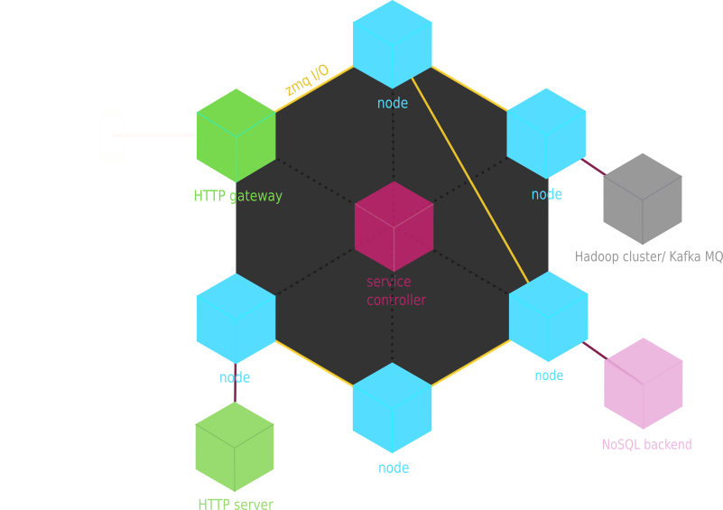
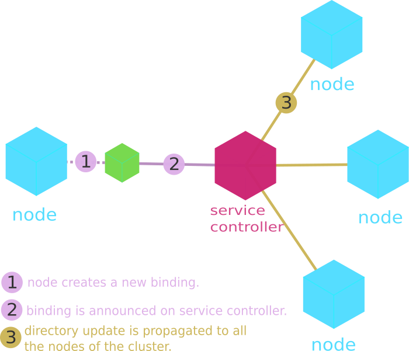

Introduction
============

.. toctree::
   :hidden:
   :includehidden:
   :titlesonly:

   self
   start
   tech_overview
   api
   security
   faq

What is n3rv ?
--------------

n3rv is a C++ library that leverages the power of ZeroMQ to create multiservices architectures.
Using ZMQ as core communication mechanism, n3rv basically provides all the components that 
modern services development requires, meaning:

 - A Services Directory & subscribing mechanism.
 - An events handler.
 - Messages encapsulation methods.
 - Logging.
 - An HTTP/ZeroMQ gateway.
 - Dynamic architecture reconfiguration.

Actually it is quite similar to `Facebook's fbzmq <https://github.com/facebook/fbzmq/>`_, 
but easier to use and with more features.

Architecture Example
--------------------

How does it work ?
------------------

Running nodes create ZMQ socket bindings, then register them to a directory service 
(service controller). Each update of the directory triggers a broadcast-update on all the 
nodes, thus making the bindings joinable by everyone. 

| 
| 
From the developer's perspective, n3rv lets you implement custom service classes, inheriting from 
the `n3rv::service` superclass. In these custom classes you will describe the complete behaviour 
of your services:

 - Which sockets they must bind.
 - Which nodes they must connect to.
 - Backend interractions.
 - Business rules, ..

After that, you just need to instanciate your defined service classes to let the magics begin !

Get n3rv
--------

n3rv framework is available on github at the following address: https://github.com/n3rvcpp/n3rv

.. code-block:: console

  git clone https://github.com/n3rvcpp/n3rv

Changelog
---------

You will find below the changelog for the different versions of n3rv framework.

v0.2:
*****

- Added support for protcol buffers messages exchange.
- Added support for syslog in logger.
- New lookup mechanism, allowing to deal with lots of subscribed nodes and bindings.
- Additionnal work on unit tests and code coverage
- Documentation largely extended
- Many bugfixes

v0.15:
******

- Implementation of httpservice (HTTP<=>ZMQ gateway)
- started unit tests implementation.

v0.1:
*****

- Initial version.

TODO
----

 - Implement redundency mechanisms for the service controller component.
 - Better support of NATed networks for service controller.
 - Add FastCGI and easy file serving support for the HTTP Gateway.
 - Improve unit tests code coverage.
 - WYSIWYG edtior to generate topologies and class templates (separate project).
 - Webmin interface for service controller.
 - Possible replacement of ZeroMQ by Nanomsg for services I/O.
 - Python binding (maybe)

Contact
-------

@WintermeW on twitter, or by email at clement.game@gmail.com

