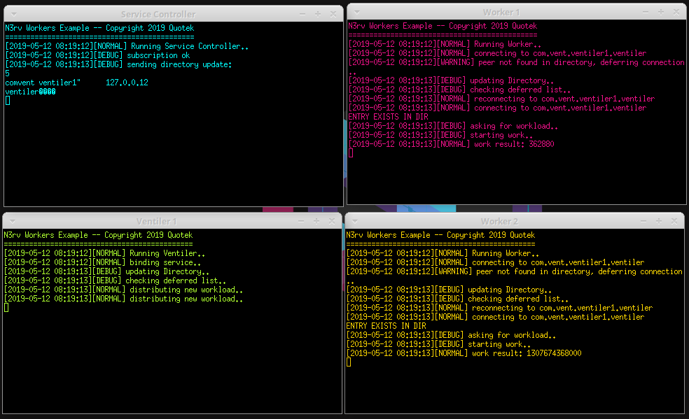

Running Examples
================

When you build examples and then go to their respective pathes (examples/*), you will see
a bunch of shell scripts, basically `launch.sh` and `stop.sh`. This is because at the exception
of hello, the examples need multiples processes to run. shell scripts are there 
to control all the processes launching or stopping at once, in different X terminals.

So in order to launch an example, cd go to its path and launch `launch.sh`

.. code-block:: console

   cd workers-single-factorial
   ./launch.sh

You should end up with a screen like this:

   Workers Factorial example output when launched

