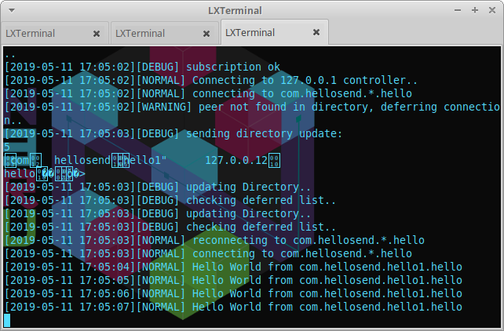

First Program
=============

Your first Program: Hello World !
---------------------------------

Now that we have correctly build and installed the n3rv library, we will start to code.

The goal here is to create a simple program that will instanciate 2 nodes and a service controller. 
Node 1 will continuously broadcast the "Hello World" string. Node 2 will connect to Node1's broadcast
stream and display data on its stdout as soon as they are received.

So we'll start by creating a new blank file called "hello.cpp" and edit it

Required Headers
****************

The first step is to add in our hello.cpp the required headers for n3rv.
Let's do this:

.. code-block:: c++

  #include <n3rv/n3rvcommon.hpp>
  #include <n3rv/n3rvservice.hpp>
  #include <n3rv/n3rvservicecontroller.hpp>

Sender Service Class
********************

The Next step will be to create a new service class. its role will just be to:

- Bind a ZMQ broadcasting socket (ZMQ_PUB)
- send "Hello World" continuously on it.

.. code-block:: c++

  /* We declare our new class inheriting from n3rv::service. */
  class hellosend: public n3rv::service {
      using n3rv::service::service;
      
      public:

      n3rv::qhandler* hello;

      int initialize() {

        //Sets a global identifier for service node.
        this->set_uid("com.hellosend.hello1");

        //creates a new ZMQ socket binding of type PUBLISH
        hello = this->bind("hello","0.0.0.0", ZMQ_PUB);

      }

      /* We add some code in the main loop to continually send "Hello World" 
         on the pub socket */
      void hkloop() {
          n3rv::message msg;
          msg.payload = "Hello World";
          this->send(hello,msg,0);
      }

  };

Receiver Service Class
**********************

Then we will declare a simple receiver class which has the following behaviour:

- connect to the sender's broadcast stream.
- display the data received.

.. code-block:: c++

    class helloreceive: public n3rv::service {
      using n3rv::service::service;
      public:

      n3rv::qhandler* hello;

      int initialize() {
          
          this->set_uid("com.hellorecv.recv1");

          /* We connect to the sender */
          hello = this->connect("com.hellosend.*.hello",ZMQ_SUB);

          /* We attach reveive callback to connection */
          this->attach(hello, hello_recv);
      }

      /*data receive callback.*/
      static void* hello_recv(void* objref, zmq::message_t* zmsg) {

          helloreceive* self = (helloreceive*) objref;      
          n3rv::message msg = n3rv::parse_msg(zmsg);
          /* We log received data */
          self->ll->log(n3rv::LOGLV_NOTICE, msg.payload + " from " + self->hello->peer_uid);
      }
    };

Instanciating All: main()
*************************

Finally we will add a main() function that will instanciate both one hellosend and one helloreceive
node, along with a service controller and let them all `run()`

.. code-block:: c++

  int main() {

       /* We create a new logger object */
       n3rv::logger* ll = new n3rv::logger(n3rv::LOGLV_DEBUG);

       /* Then we tell it to perform stdout display */
       ll->add_dest("stdout");

       /* We asynchronously start a new service controller */
       n3rv::start_controller("0.0.0.0",10001,ll);

       /* We instanciate a new hellosend node */
       hellosend hs("127.0.0.1",10001,ll);

       /* We initialize it and run it asynchronously */
       hs.initialize();
       hs.run_async();

       /* We instanciate a new helloreceive node. */
       helloreceive hr("127.0.0.1",10001,ll);
       
       /* We initialize then run it */
       hr.initialize();
       hr.run();

 }

Full Code
*********

The full hello.cpp code source is then the following:

.. code-block:: c++

    #include <n3rv/n3rvcommon.hpp>
    #include <n3rv/n3rvservice.hpp>
    #include <n3rv/n3rvservicecontroller.hpp>
  
    class hellosend: public n3rv::service {
      using n3rv::service::service;
      public:

      n3rv::qhandler* hello;
      int initialize() {

        this->set_uid("com.hellosend.hello1");
        hello = this->bind("hello","0.0.0.0", ZMQ_PUB);

      }

      void hkloop() {
          n3rv::message msg;
          msg.payload = "Hello World";
          this->send(hello,msg,0);
      }

    };

    class helloreceive: public n3rv::service {
      using n3rv::service::service;
      public:

      n3rv::qhandler* hello;

      int initialize() {
          
          this->set_uid("com.hellorecv.recv1");
          hello = this->connect("com.hellosend.*.hello",ZMQ_SUB);
          this->attach(hello, hello_recv);
      }

      //data receive callback.
      static void* hello_recv(void* objref, zmq::message_t* zmsg) {
          helloreceive* self = (helloreceive*) objref;      
          n3rv::message msg = n3rv::parse_msg(zmsg);
          self->ll->log(n3rv::LOGLV_NOTICE, msg.payload + " from " + self->hello->peer_uid);
      }

    };

    int main() {

       n3rv::logger* ll = new n3rv::logger(n3rv::LOGLV_DEBUG);
       ll->add_dest("stdout");

       n3rv::start_controller("0.0.0.0",10001,ll);

       hellosend hs("127.0.0.1",10001,ll);
       hs.initialize();
       hs.run_async();

       helloreceive hr("127.0.0.1",10001,ll);
       
       hr.initialize();
       hr.run();
    }

Compile & Run
-------------

Now that we wrote our program, it's time to compile and run it:

.. code-block:: console

   g++ hello.cpp -o hello -ln3rv -lzmq -lpthread && ./hello

If compiling succeded, here's what you should see: 

